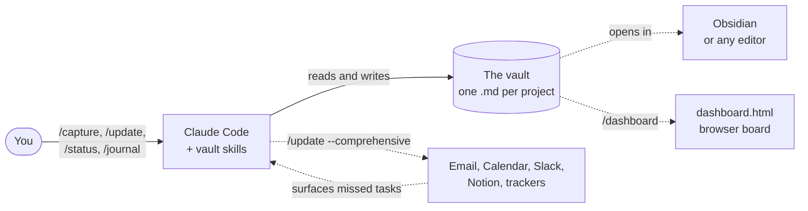
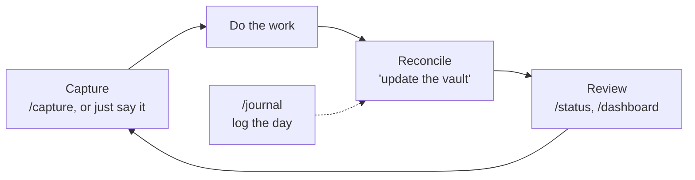
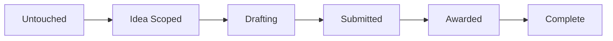
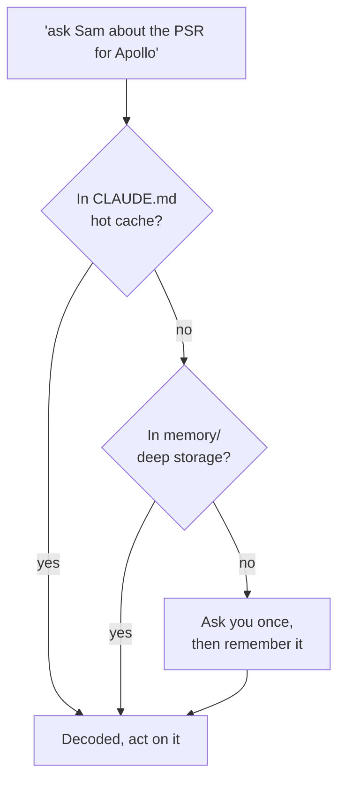

# The research-vault user guide

*What the system is, the mental model behind it, and how to use it day to day. For installation, see [GETTING-STARTED.md](GETTING-STARTED.md); for the quick command and syntax reference, see the appendices at the end.*

---

## What it is, in one picture

In essence, the vault is a filing cabinet that Claude knows how to read. It is an ordinary folder of plain-text markdown files — one file per project — and nothing in it is locked inside an application or a database. You can open it in any editor, search it with `grep`, version it with `git`, and read it in ten years. What the plugin adds is a shared set of conventions: where a task belongs, how a deadline is written, which file a new proposal goes in. Claude learns those conventions once, then keeps the files honest for you.

That division is the whole idea. The files are yours; the plugin is the layer of habits on top of them.



Three parts are worth keeping separate in your mind. The **vault** is your data — the markdown files. The **plugin** is the convention layer — the slash commands and the skills that encode how the vault is meant to be used. Everything else — Obsidian, the HTML dashboard, the email and calendar connectors — is optional surface area that reads the same files. Note that none of the optional pieces are required; the vault works fully offline with nothing more than Claude Code and a text editor.

## How a task is written

A task is a GitHub-style checkbox line. On its own that is enough — `- [ ] call the program officer` is a perfectly good task. When you want a task to carry a deadline, a priority, or a person, you append Obsidian Tasks-plugin emoji, each of which is a typed field rather than decoration:

```markdown
- [ ] **Send the revised draft to Sam** 🔼 📅 2026-07-10 #sam-rivera
```

Read left to right, that line says: an open task, titled in bold, high priority (🔼), due on 2026-07-10 (📅), involving the person whose handle is `#sam-rivera`. When the task is finished it becomes `- [x]` and picks up a completion date:

```markdown
- [x] **Send the revised draft to Sam** ✅ 2026-07-11
```

The emoji matter because the dashboard and the status view read them back as real fields — an overdue 📅 turns a task red, a 🔼 floats it to the top, a `#handle` becomes a filter. The full set is small, and it is listed in [Appendix B](#appendix-b--task-syntax-reference). It is straightforward to ignore the emoji entirely and still get a working task list; they are there for when structure earns its keep.

People are written as short handles — `#firstname-lastname` by convention — rather than full names. The handle is a stable key; who it points to lives in your roster (see [The two-tier memory](#the-two-tier-memory) below), so the same `#sam-rivera` means the same person across every file.

## The everyday loop

Most days, working the vault is a small loop: you capture things as they arrive, you do the work, you let Claude reconcile what changed back into the files, and you glance at the state when you need the big picture. Each step has a command, but you rarely have to think in commands — plain language reaches the same skills.



### Capturing — `/capture`

Capture is built around a ten-second rule: a thought should reach the right file before it evaporates. You give Claude one line, and it drops the task into the most likely project file, falling back to `inbox.md` when the right home is ambiguous.

```
You:  /capture remind me to email the program officer about the no-cost extension 🔼

Claude:  Added to grants-admin.md (Active):
         - [ ] **Email the program officer about the no-cost extension** 🔼
```

You do not have to name the file, and you do not have to use the command at all — "add a task to the main grant: finish the budget justification by Friday" routes to the same place. That said, anything genuinely homeless lands in `inbox.md` on purpose, to be sorted later rather than lost now.

### Reconciling — `/update`, or "update the vault"

The phrase *update the vault* is a small ritual with a specific meaning: it is not a single append, but a request to reconcile **every** project file the recent conversation touched. Claude re-reads the relevant files, advances or closes the tasks you actually moved, captures any new ones, records decisions, and appends a short entry to today's daily note. In other words, it makes the files agree with what just happened.

```
You:  I finished the budget justification and sent it to Sam; she's reviewing.
      Also we decided to drop the third aim. Update the vault.

Claude:  grants-main.md
           ✅ Budget justification (done 2026-07-03)
           - [ ] **Waiting on Sam's review of the budget** ⏳ 2026-07-03
           decision logged: third aim dropped — scope was too broad for one year
         daily_notes/2026-07-03.md  ← work-log line added
```

There is also a deeper mode, `/update --comprehensive`, which scans your connected sources — email, calendar, chat, a project tracker — for commitments you made but never wrote down, and surfaces them for you to accept or ignore. It is honest about gaps: if a source is not connected, it says so and works with what it has.

### Reviewing — `/status` and `/dashboard`

Two views answer "where do things stand?". `/status` groups your proposals and projects into six buckets that march from idea to outcome:



The buckets come from the `**Status:**` line near the top of each project file, so a file without one will not classify — adding a single status line is all it takes to bring a project into the view. `/status` always prints every bucket, even the empty ones, so the shape of your pipeline is visible at a glance.

`/dashboard` is the other view: it regenerates `dashboard.html`, a single self-contained page you open in a browser, with filters for overdue, this-week, high-priority, and by-project. The dashboard is deliberately **read-only** — it is a window onto the files, not an editor of them, so there is no way for a stray click to corrupt your notes. Edits still happen in your editor or through the commands. The dashboard needs Python 3; everything else here does not.

### Logging the day — `/journal`

Each calendar day has one note under `daily_notes/YYYY-MM-DD.md`, with stable headings — Summary, Work log, Tasks touched, Decisions & notes, Follow-ups. `/journal "shipped the figure, blocked on data access"` appends a work-log line; the longer forms record a decision or a follow-up. The journal is append-only by design: it is a record of what happened, so Claude adds to it surgically and never rewrites it.

### Sorting the inbox — `/triage`

`/triage` is the weekly five-minute sweep of `inbox.md`. For each loose item, Claude proposes a route — move it to a project file, delete it, defer it, or split out a new project file — and you confirm. It is the counterweight to fast capture: capture is allowed to be sloppy precisely because triage cleans up after it.

## The two-tier memory

A vault is only useful if Claude understands your shorthand. When you write "ask Sam about the PSR for Apollo," the words mean nothing without context. The memory system supplies it, and it is split into two tiers for the same reason a computer has both RAM and a disk: a small fast layer for the things you touch constantly, and a large slow layer for everything else.



The **hot cache** is the vault's `CLAUDE.md`: roughly your thirty most-used people, your active projects, the terms you reach for daily, and your preferences. It is meant to cover the large majority of decoding without a lookup. The **deep storage** is the `memory/` folder — a complete glossary, a profile per person, a file per project — which can grow without bound and is consulted only when the hot cache misses. When even that comes up empty, Claude asks you once and writes the answer down, so the next occurrence is free. Over time the cheap, frequent things drift up into the hot cache and the stale things drift down; this keeps the fast layer both small and relevant.

The practical payoff is that a handle like `#sam-rivera` or a codename like "Apollo" resolves the same way everywhere, and you can write tasks in your own compressed language without losing the meaning.

## How projects and proposals are organized

Every project is one markdown file, and `projects.md` is the manifest that lists them. A new line of work becomes a new file when it has its own deliverables and its own people; until then it can live as a task inside an existing file. The guiding question is simply whether the work has enough gravity to deserve its own page.

Proposals get a little extra structure, because a grant has a lifecycle worth tracking. Funding calls you are watching live in `proposal-solicitations.md`, grouped by the same six buckets the status view uses; science directions that do not yet have a home call live in `proposal-ideas.md`. When an idea finds its solicitation, it is promoted into a real project file. This is the machinery behind `/status`: it reads those two files plus each project's `**Status:**` line and assembles the picture.

## Working without the extras

It is worth saying plainly what you can skip. The vault is fully functional with only Claude Code and a text editor. Obsidian is optional — it makes `dashboard.md` a live in-app board and renders the emoji as real task fields, but the files are plain markdown either way. Python is optional and only powers `/dashboard`. The MCP connectors — email, calendar, chat, trackers — are optional and only feed `/update --comprehensive`. When something is missing, the affected command says so and the rest keeps working; nothing about the core loop depends on the extras.

---

## Appendix A — Command reference

| Command | What it does |
|---|---|
| `/start` | First run: create the vault and interview you to seed it. Later runs: verify the files and open today's note. Safe to re-run; never overwrites. |
| `/capture <text>` | Drop a one-line task into the most likely project file, or `inbox.md` if ambiguous. |
| `/update` | "Update the vault": reconcile every project file the recent conversation touched; advance/close tasks; append to today's note. |
| `/update --comprehensive` | The above, plus a scan of email, calendar, chat, and trackers for commitments you never wrote down. |
| `/status` | The six-bucket proposal/project status report. |
| `/journal "<text>"` | Append to today's daily note (a work-log line by default; longer forms log a decision or follow-up). |
| `/triage` | Walk `inbox.md` and route each loose item — move, delete, defer, or split into a new file. |
| `/dashboard` | Regenerate the read-only `dashboard.html` board (needs Python 3). |

You rarely need the commands by name — plain language ("what's open?", "I finished the figure", "add a task to the grant") reaches the same skills.

## Appendix B — Task syntax reference

A task is `- [ ]` (open) or `- [x]` (done), a title (bold by convention), and any of the following emoji fields:

| Token | Field | Example |
|---|---|---|
| 📅 | Due date | `📅 2026-07-10` |
| ⏳ | Scheduled / start date | `⏳ 2026-07-01` |
| ✅ | Completion date (on done tasks) | `✅ 2026-07-11` |
| 🔼 | High priority | `🔼` |
| 🔽 | Low priority | `🔽` |
| `#handle` | A person | `#sam-rivera` |

A fully decorated example:

```markdown
- [ ] **Submit the no-cost extension request** 🔼 📅 2026-07-15 #sam-rivera
  - [ ] draft the justification paragraph
  - the program officer prefers email over the portal
```

Indented `- [ ]` lines are sub-tasks; other indented lines are kept as notes. All dates are absolute `YYYY-MM-DD`.

## Appendix C — Vault layout

```text
<vault>/
├── CLAUDE.md            ← hot-cache memory (your people/projects/prefs) + plugin pointer
├── README.md            ← human-readable vault overview
├── projects.md          ← the project manifest
├── inbox.md             ← capture catch-all
├── dashboard.md         ← Obsidian Tasks queries (live in-app board)
├── dashboard.html       ← optional browser board, via /dashboard
├── proposal-solicitations.md   ← funding calls you are tracking (read by /status)
├── proposal-ideas.md           ← idea-first proposal capture
├── <project>.md         ← one file per project
├── daily_notes/
│   └── YYYY-MM-DD.md     ← one note per day
└── memory/              ← two-tier memory (hot cache lives in CLAUDE.md)
    ├── glossary.md
    ├── people/<handle>.md
    ├── projects/<name>.md
    └── context/
```

## Appendix D — A short worked example

A morning, start to finish:

```
You:    /capture reviewer 2 wants a sensitivity analysis before we resubmit 🔼

Claude: Added to paper-resubmission.md (Active):
        - [ ] **Run the sensitivity analysis reviewer 2 asked for** 🔼

You:    [an hour later] done with the analysis, results are in the repo.
        the resubmission is basically ready. update the vault.

Claude: paper-resubmission.md
          ✅ Sensitivity analysis (done 2026-07-03)
          status: Drafting → Submitted-pending once the cover letter is in
        daily_notes/2026-07-03.md  ← work-log line added

You:    what's open across everything?

Claude: [/status — six buckets, each project on one line, with the
         resubmission now sitting under "Submitted and Pending"]
```

The point of the example is the rhythm, not the commands: capture without ceremony, work, say *update the vault*, and let the files catch up to reality.
